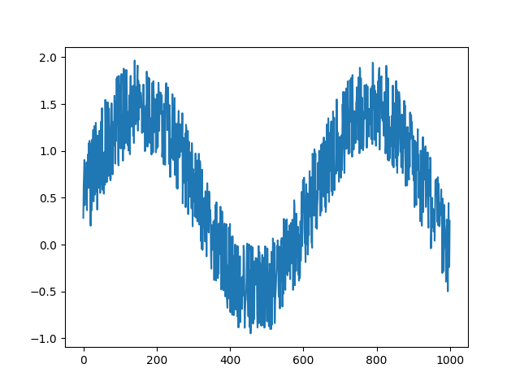
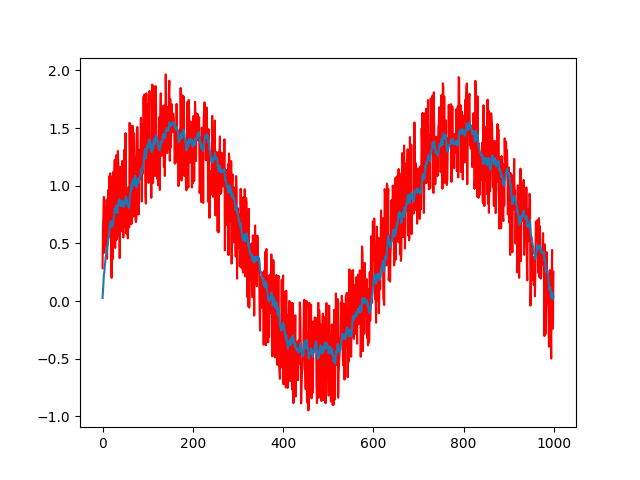

# Corona Coding Club Day 1 KEY

## Problem 1
```python
age = 17
for i in range(age//2):
  print(i*2)
```

## Problem 2
```python
name = input("What is your name?")
print(name + " you are the best at eating pizza!!!")
```

## Problem 3
```python
# the user agrees to think of a number in [1,100]

low = 1
high = 100
name = input("What is your name?")

while low < high:
  userFeedback = input("Hey"+ name+ ", Is your number lower than, higher than, or equal to " + str((low+high)//2) + "( please respond with low, high, or equal)")
  
  if userFeedback == "low":
    high = (low + high)//2
  elif userFeedback == "high":
    low = (low+high)//2
  elif userFeedback == "equal":
    print("YAY I guessed IT!")
    break
  else:
    print("lol you need to respond with low/high/equal. you trying to trick me?")
if low == high:
  print("aha, your number is " + low)
else:
  print("WUT")

```

## Problem 4
```python

# first a recursive solution.
# this is SLOW and dumb
def fibRecurse(n):
  if n == 1 or n==2:
    return 1
  else:
    return fibRecurse(n-1)+fibRecurse(n-2)

# now a faster solution
def fibLoop(n):
  cur = 1
  last = 1
  for i in range(n):
    tmp = cur 
    cur = last + cur
    last = tmp
  return fibLoop(n)

# note: this one is super slow!
print(fibRecurse(5))
# note: this one is somewhat fast:
print(fibLoop(100))

# O(log n) solution !!! very cool.

import numpy as np
matrix = np.array([[1,1],[1,0]])

# "exponentiation by squaring"
def matrixPower(n):
  if n == 1:
    return matrix
  tmp = matrixPower(n//2) # replace this with n/2 if you are on python2 rather than python3 @ZIYONG ;)
  if n%2 == 0:
    return np.matmul(tmp, tmp)
  else:
    return np.matmul(np.matmul(tmp, tmp), matrix)

np.dot(matrixPower(10), np.array([1,1]))[0]

```

## Problem 5
```python
# prime sieve!!

n = 100
x = [True for i in range(n+1)] # x[i] = 1 if i is prime
for i in range(2,n):
  j = 2
  while j*i <= n:
    x[i*j] = False
    j+=1

x[0] = False; x[1] = False 
for i in range(len(x)):
  print(f"is {i} prime? {x[i]}")

```

## Problem 6
```python
def isPrime(x):
  if x==1:
    return False
  if x==2:
    return True
  i = 1
  while i*i < x:
    i += 1
    if x%i == 0:
      return False
  return True

for i in range(1,100):
  print(i, isPrime(i))

```

## Problem 7

```python

def gcd(n,m):
  n,m = max(n,m), min(n,m)
  if n % m == 0:
    return m
  return gcd(n%m, m)

print(gcd(700,900))
```


## Problem 9
```python
import numpy as np
import matplotlib.pyplot as plt

data = np.random.rand(1000) + np.sin(np.linspace(0,10,1000))
plt.plot(data)
plt.show()

gamma = 0.9

smoothedData = []

cur = 0

for i in range(len(data)):
    cur = gamma*cur + (1-gamma)*data[i]
    smoothedData.append(cur)

plt.plot(data, c='r')
plt.plot(smoothedData)
plt.show()
```



