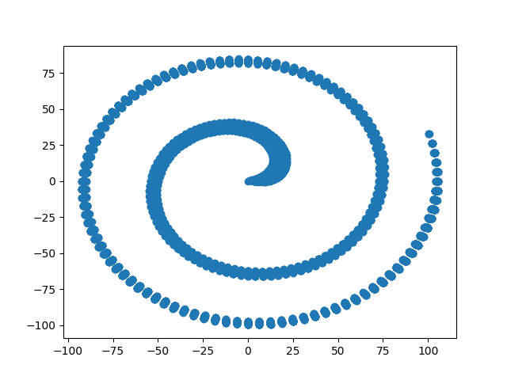

--- 
title: Corona Club Day 2 Key
author: Max, Alek, and Ziyong!!
---

## EZ warmup problems


## PROBLEM 1
```python
def countwords(sentence, word):
    new_sent = sentence.lower().count(word.lower())
    print(new_sent)
    
countwords("Like it’s really easy, like dude what’re you like doing like what is this question, like this seems dumb like; oh man liken this tutorial unto yourselves like get scammed like wow like like like like ziyong is a pro yah like know?","like")
```


## PROBLEM 1.5
```python
def printeveryotherword(sentence):
    new_sent = sentence.split()
    every_other_word = []
    for i in range(0, len(new_sent), 2):
        every_other_word.append(new_sent[i])
    print(" ".join(every_other_word))

printeveryotherword(sentence)
```


## PROBLEM 2
```python
array = [1, 3, -5, 5]

def findbiggestsquare(array):
    biggest_val = 0
    for i in range(len(array)):
        if array[i]*array[i] > biggest_val*biggest_val:
            biggest_val = array[i]
    print(biggest_val)

findbiggestsquare(array)
```


## PROBLEM 3
```python
import random

def giverandomcoronaadvice(coronaadvice):
    print(random.choice(coronaadvice))

coronasafety = ['wash hands', 'stay away from people', 'cancel school', 'learn to code', 'play tennis', 'travel']
giverandomcoronaadvice(coronasafety)
```


## Number Theory


## PROBLEM -1
```python
import pprint

def gcd(n, m):
    n, m = max(n, m), min(n, m)
    if n % m == 0:
        return m
    return gcd(n%m, m)

def relatively_prime(n):
    pprint.pprint([[gcd(i, j) == 1 for i in range(1, n)] for j in range(1, n)])

relatively_prime(10)
```

 
## PROBLEM 0.5
```python
import numpy as np
def estimate_pi(n):
    count = 0
    for i in range(0,n):
        point = np.random.rand(2)
        if (point[0]**2 + point[1]**2 <= 1):
            count += 1
    print(4 * count/n)

estimate_pi(100000)
```

## PROBLEM 0
**Ziyong's solution:**
```python
def flipFlop(n, numberOfPeople): #n is the person who we check to play
    number = 1
    person = 1
    direction = 1
    word = ""
    while True:
        if number % 7 == 0 and number % 8 == 0:
            word = "FLIPFLOP"
            print(person,word)
            if person == n:
                break
            else:
                direction *= -1
                person = (person + direction * 2)%numberOfPeople
            number += 1
        if number % 7 == 0:
            word = "FLIP"
            print(person,word)
            direction *= -1
            if person == n:
                break
            else:
                person = (person + direction * 1)%numberOfPeople
            number += 1
        if number % 8 == 0:
            word = "FLOP"
            print(person,word)
            if (person == n):
                break
            else:
                person = (person + direction * 2)%numberOfPeople
            number += 1
        else:
            word = number
            print(person,word)
            if (person == n):
                break
            else:
                person = (person + direction * 1)%numberOfPeople
            number += 1
flipFlop(50, 100)
```

**Alek's solution**
```python
direction = 1
person = 0
number_of_ppl = 100
data = []
for i in range(1,5600*2):
    if i % 7 == 0:
        direction *= -1
    if i % 8 == 0:
        person += direction
    person += direction
    person = person % number_of_ppl
    data.append(person)

import matplotlib.pyplot as plt
import numpy as np

points = [(np.cos(data[i]*np.pi*2/100)*(i**0.5), np.sin(data[i]*np.pi*2/100)*(i**0.5)) for i in range(len(data))]
plt.scatter([x[0] for x in points], [x[1] for x in points])
plt.show()

```



## PROBLEM 1 
```python
def exp_by_squaring(x, n): #x^n
    val = 1
    while n > 0:
        if n%2 != 0:
            val = (val*x)
        x = x*x%100000
        n = int(n/2)
    return val%100000
print(exp_by_squaring(2, 123412341234134))
```

**Alek's solutions**
```python
n = 123412341234134
mod = 10**5

# ok, here is the "basic" recursive solution:

def powmod2(n, mod):
    if n==1:
        return 2
    tmp = powmod2(n//2, mod)
    if n % 2 == 0:
        return (tmp*tmp)%mod
    else:
        return (((tmp*tmp)%mod)*2)%mod 

print(powmod2(n,mod))

# here is the troll solution
print(pow(2, n, mod))
# yeah thats right, its a built in function!

# here is a solution that is too cool for school. 
# so freaking pro

def v2(n):
    ct = 0
    while n % 2 == 0:
        n//= 2
        ct += 1
    return ct

ct = 0
running = 1
while running != 1<<v2(mod) or ct  <= v2(mod):
    running = (running<<1) % mod
    ct += 1

# note that 2**ct % mod == 2**v2(mod)

# so 2**n % mod = (2**ct)**(n//ct) * (2**(n%ct)) % mod

prod = 1
while n > 1:
    prod = (prod*powmod2(n%ct, mod))% mod
    n = (n//ct)*v2(mod)
print(prod)

```


## PROBLEM -0.5
```python
import numpy as np

def check_magic_square(square):
    dia1, dia2 = 0, 0
    for i in range(len(square)):
        row, col = 0, 0
        for j in range(len(square)):
            row += square[i,j]
            col += square[j,i]
        if row != col:
            return("This is not a magic square")
        dia1 += square[i,i]
        dia2 += square[i,len(square)-i-1]
    if dia1 == dia2 == row == col:
        return("This is a magic square")

#test with magic square:
print(check_magic_square(np.array([[8, 1, 6],[3, 5, 7],[4, 9, 2]])))
#test with random order of numbers:
print(check_magic_square(np.array([[8, 1, 5],[3, 6, 7],[4, 9, 2]])))

def create_magic_square(n): #only works with odd n
    magic_square = np.zeros((n , n),dtype=int)
    i, j = 0, n//2
    num = 1
    while num <= n*n:
        magic_square[i, j] = num
        num += 1
        nexti, nextj = (i-1)%n, (j+1)%n
        if magic_square[nexti, nextj]:
            i+=1
        else:
            i, j = nexti, nextj
    print(magic_square)
    print(check_magic_square(magic_square))

create_magic_square(3)
```


